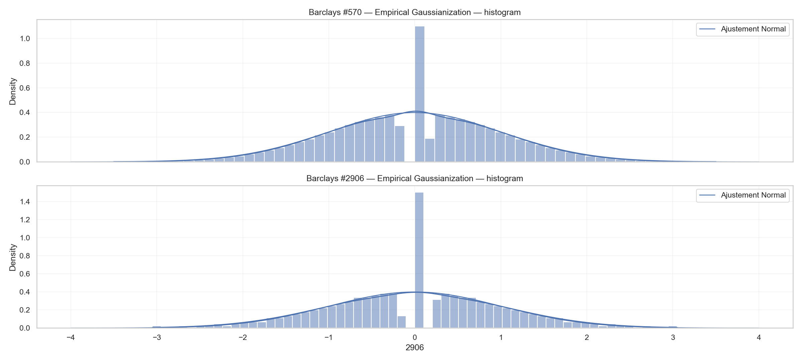
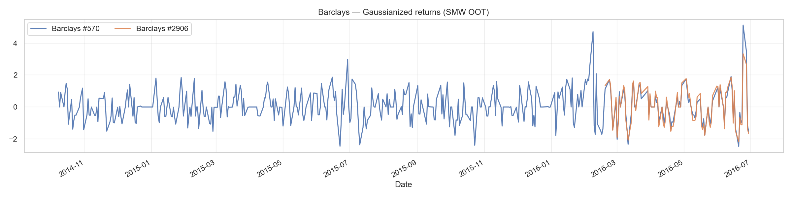
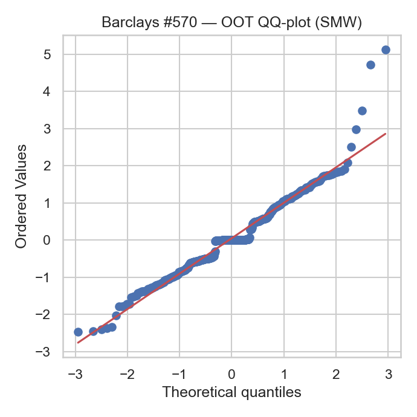
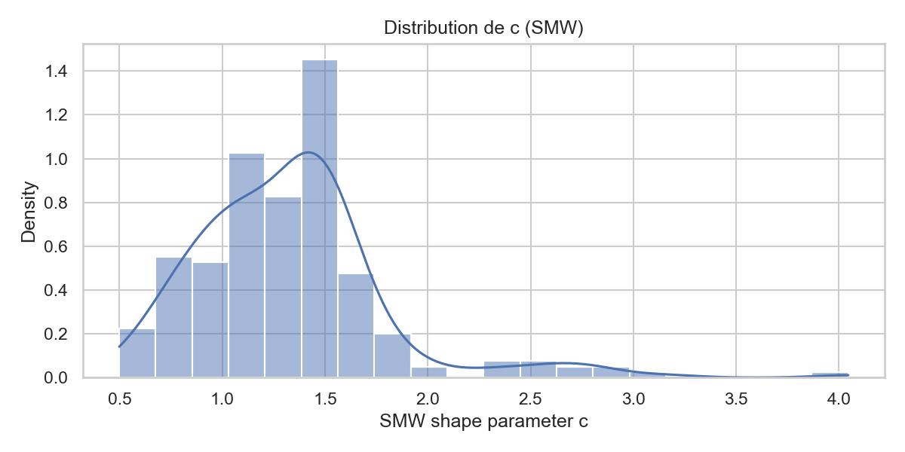

# CDS Returns → Gaussianization

Small toolkit to clean single-name **5Y CDS** time series, compute daily returns, and map each issuer’s series to an approximately standard Normal scale so z-scores are comparable across names.

## Method (short)

Given a return series $x_t$ per `CDS_Id`:

1. **Empirical Gaussianization (non-parametric)**

   $$
   u_t=\frac{\mathrm{rank}(x_t)-0.5}{N}\in(0,1),\qquad
   z_t=\Phi^{-1}(u_t),
   $$

   where $\Phi^{-1}$ is the standard Normal quantile. This preserves order and avoids distributional assumptions.

2. **SMW transform (parametric, out-of-time check)**
   We assume a **Symmetric Modified Weibull** density

   $$
   f(x;c,\chi)=\frac{c}{2\sqrt{\pi}\,\chi^{c/2}}\,
   |x|^{\,\frac{c}{2}-1}\exp\!\big[-(|x|/\chi)^c\big],
   $$

   fit $(c,\chi)$ on a **train** window (histogram least squares), and apply the closed-form mapping to held-out data:

   $$
   z=\operatorname{sign}(x)\,\sqrt{2}\left(\frac{|x|}{\chi}\right)^{c/2}.
   $$

   We check Normality out-of-time with KS/QQ diagnostics.
## Key Figures









## Data

Place CSVs in `data/`:

```
XDS_Id_Mapping.csv   # columns: Name;CDS_Id
ITRAXX5Y.csv         # columns include: Date;CDS_Id;Y05
```

Dates are day-first. `Y05` is the 5Y spread (bps). We keep last-of-day observations and compute daily percent changes. Older dates can be filtered (default: post-2008).

## Usage

```bash
python -m venv .venv && source .venv/bin/activate
pip install -U numpy pandas matplotlib seaborn scipy
```

Adjust at the top of the main notebook: `SELECTED_NAMES`, `POST_START`, `OOT_FRACTION` or `OOT_START`.

## Outputs

* `output/gaussian_empirical_wide.csv` — empirical z-scores (dates × `CDS_Id`)
* `output/smw_params_train.csv` — fitted $(c,\chi)$ per ID (train)
* `output/smw_oot_diagnostics.csv` — KS stats, mean/std (OOT)
* `output/*png` — time series, histograms (with Normal overlay), QQ-plots, parameter histograms

## Notes / limitations

* SMW is **symmetric**; skewed series may be better handled by the empirical mapping or an asymmetric extension.
* Histogram fitting is simple and fast; replace with MLE if you need tighter inference.
* Short series are skipped (guardrails in code).
* This is a preprocessing/monitoring workflow, **not** a pricing model.

License: MIT.
